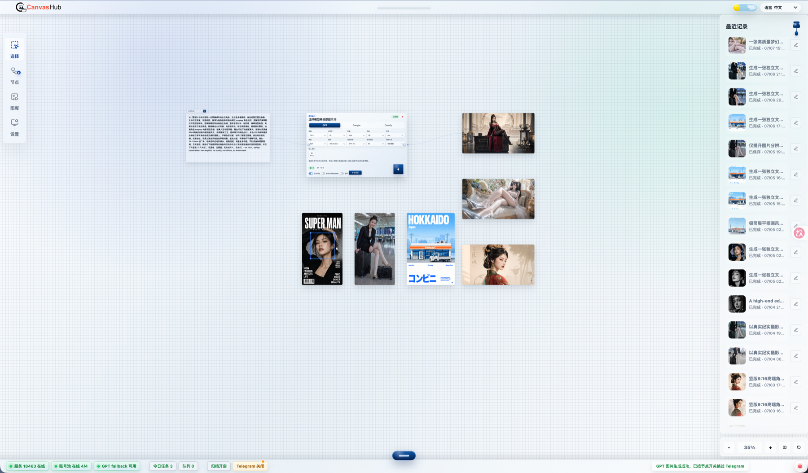

<p align="center">
  
</p>

# CanvasHub

**Language:** English | [中文](README.zh-CN.md)

CanvasHub is a modular node-based Image2/banana image generation, image asset
management, and prompt optimization project.

* Image2 generation requires importing Codex OAuth, using a local Codex login,
  or importing web RT/AT credentials through the account-pool API. Banana
  generation requires a third-party API.

The project stays small in deployment shape: one Python HTTP server serves the
Mini App/static desktop UI and the JSON APIs used by the UI. Generated images
are archived locally, and Telegram syncs those archived files.

Note: the Telegram Mini App requires a public IP, reverse proxy, or tunnel.
* The pose-reference node, layout node, and ComfyUI calls are not finished yet.

## Safety Defaults

- The server binds to `127.0.0.1` by default.
- Public mode is opt-in through Settings Center -> System.
- Public mode requires a Mini App access password.
- Runtime data and local secrets are ignored by Git.
- `settings.json` is local configuration and must not be committed.
- The built-in password gate is lightweight access control, not enterprise
  multi-user RBAC.

## Quick Start

```bash
python3 -m venv .venv
. .venv/bin/activate
python3 -m pip install -r requirements.txt
cp settings.example.json settings.json
python3 server.py
```

Then open:

```text
http://127.0.0.1:18463/desktop.html
```

On Windows, double-click `start-windows.bat` from the project root for a
one-click launch. It creates `.venv` when needed, installs dependencies, and
opens the desktop page. Use `stop-windows.bat` to stop the local app.

On macOS/Linux, use `./start.sh` to start the local app.

If you expose the app through a tunnel or reverse proxy and want `start.sh` to
print that URL for BotFather setup, set `MINIAPP_PUBLIC_URL`:

```bash
MINIAPP_PUBLIC_URL=https://your-domain.example ./start.sh
```

## Desktop App

Download the desktop app from
[GitHub Releases](https://github.com/DreamLoveBetty/CanvasHub/releases). Settings,
account information, image archives, caches, and optional components are stored
in the current user's application-data directory and remain available after an
app upgrade or reinstall.

### Upscale Component

To keep the initial installer smaller, the local upscale component is installed
on demand. The first time an upscale node runs, CanvasHub automatically
downloads, verifies, and installs the correct component in the background. No
manual download or extraction is required. Progress is shown in the app, and
later upscale jobs reuse the installed component.

Component installation requires access to GitHub. If a download is interrupted,
run the upscale node again to resume or retry. Image generation, editing, and
gallery features remain available when the optional component is not installed.

## Configuration

Most runtime settings can be edited from the desktop Settings Center.

- System: bind address, port, public mode, and access password.
- Telegram: bot token, chat id, allowed user ids, and Telegram proxy.
- Provider: local Codex provider, managed Codex OAuth, transport mode, timeout.
- Third-party: nano banana / compatible image APIs.
- Account pool: account connections and authorized-account management.
- Polish: prompt-skill provider/model configuration.
- Paths: archive directory, source image directory, and tasks database.

Default storage paths are project-local:

```text
data/archive
data/source_images
tasks.db
```

The path settings may be changed in Settings Center -> Paths. Relative paths are
resolved from the repository root.

## Optional Runtime Remote Prompt Sources

The gallery workspace can optionally sync prompt/example-image records from
public remote repositories at runtime. Synced data is written under local
runtime paths such as `data/source_images/`. Thanks to the authors for their
curation and open-source work; here are several repository links.

| Source | Upstream repository |
| --- | --- |
| GPT Image 2 | `https://github.com/EvoLinkAI/awesome-gpt-image-2-API-and-Prompts` |
| Awesome GPT Image | `https://github.com/ZeroLu/awesome-gpt-image` |
| GPT-4o Image | `https://github.com/ImgEdify/Awesome-GPT4o-Image-Prompts` |
| YouMind GPT Image 2 | `https://github.com/YouMind-OpenLab/awesome-gpt-image-2` |
| YouMind Nano Banana Pro | `https://github.com/YouMind-OpenLab/awesome-nano-banana-pro-prompts` |
| DavidWu GPT Image2 Prompts | `https://github.com/davidwuw0811-boop/awesome-gpt-image2-prompts` |

## Optional 3D Assets

The public repository does not bundle Director Stage `xbot.glb` / `ybot.glb`
model files. Without them, the app uses the procedural mannequin fallback.

To enable the optional GLB mannequins, download the files and place them at:

```text
static/pose/mannequin/xbot.glb
static/pose/mannequin/ybot.glb
```

See `static/pose/mannequin/README.md` for source links and commands.

## Public Mode

Public mode is disabled by default. To expose the app beyond the local machine:

1. Open `desktop.html`.
2. Go to Settings Center -> System.
3. Enable Public Mode.
4. Set a non-empty access password.
5. Save and restart the Python server.

Public mode only changes the server bind address. For an internet-facing
deployment, use HTTPS, a reverse proxy, firewall rules, and Telegram domain
settings appropriate for your environment.

## Third-party Notices

See `THIRD_PARTY_NOTICES.md`.

## License

Project-owned source code is licensed under the MIT License. Bundled third-party
code and assets remain under their own licenses; see `THIRD_PARTY_NOTICES.md`.
